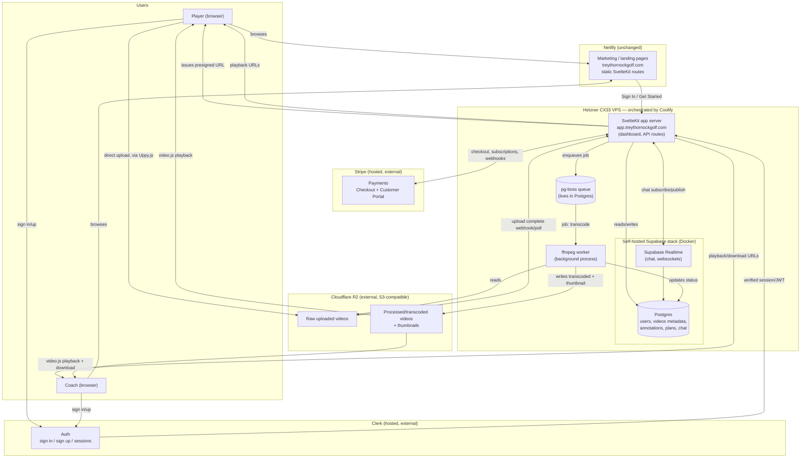

# Infrastructure Architecture — MVP

This documents the infrastructure decided in `roadmap.md`, laid out as a system diagram and request/data flows. App requirements and feature design come after this.

## System diagram

## Component responsibilities

| Component | Role | Why here |
|---|---|---|
| **Netlify** | Hosts marketing/landing pages only (`treythornockgolf.com`) | Static, SEO-driven, no backend dependency — no reason to move it off Netlify |
| **Hetzner VPS (Coolify)** | Hosts the actual app (`app.treythornockgolf.com`), the self-hosted Supabase stack, and the ffmpeg worker | Needs a persistent server — serverless (Netlify Functions) can't run a long-lived job worker or own a database |
| **Clerk** | Auth — sign in/up, session/JWT issuance | Kept hosted; highest-risk component to self-host, free tier covers MVP |
| **Self-hosted Supabase → Postgres** | System of record: users, coaches, video metadata, annotations (JSON + timestamp), practice plans, chat messages, payment records | Relational data model fits Postgres better than a document store |
| **Self-hosted Supabase → Realtime** | Chat (item 12) and any live status updates (e.g. "processing complete") | Already part of the self-hosted stack, no separate service needed |
| **pg-boss** | Job queue for the video processing pipeline | Runs inside Postgres — no Redis needed at MVP scale |
| **ffmpeg worker** | Consumes queue jobs: transcode uploaded video to a web-friendly format, generate thumbnail | Server-side only; never touched by the browser |
| **Cloudflare R2** | Object storage for raw and processed video files | S3-compatible, no egress fees — matters since users/coaches stream and download often |
| **Stripe** | Payments/subscriptions | External, standard Checkout + Customer Portal integration |

## Key data flows

**Video upload → processing → playback**
1. Browser asks the app server for a presigned upload URL.
2. Browser (via Uppy.js) uploads the raw video file directly to R2 — bytes never pass through the app server.
3. App server enqueues a `video.uploaded` job in pg-boss (Postgres).
4. The ffmpeg worker picks up the job, reads the raw file from R2, transcodes it + generates a thumbnail, writes the result back to R2, and updates the video's row in Postgres (status, processed URL, thumbnail URL).
5. Browser plays the processed video via video.js; Fabric.js overlays the annotation canvas on top, reading/writing annotation JSON tied to timestamps in Postgres.
6. Coach "re-record" (item 8) only replaces the video file for the affected time range and re-runs step 3–4 for that segment — annotation rows outside that range are untouched.

**Auth**
1. Player/coach signs in via Clerk on either the marketing site or the app.
2. Clerk issues a session; the SvelteKit app on the VPS verifies it on each request.
3. Postgres rows are scoped by Clerk user ID — no auth logic lives in Postgres itself.

**Chat (item 12)**
1. Browser opens a Supabase Realtime subscription to a conversation channel.
2. Messages are written to Postgres via the app server; Realtime pushes them to subscribed clients.

**Payments**
1. App server creates a Stripe Checkout session for a subscription/service tier.
2. Stripe webhooks notify the app server of payment events; app server updates the user's plan/status in Postgres.

## Deferred (post-MVP)

Pose-estimation / ML swing analysis (OpenCV + MediaPipe) is not in this diagram — per `roadmap.md`, it will run as a separate Python worker consuming a new pg-boss job type once added, reading the **raw** (not just processed) video from R2. No changes to this architecture are needed to add it later.
